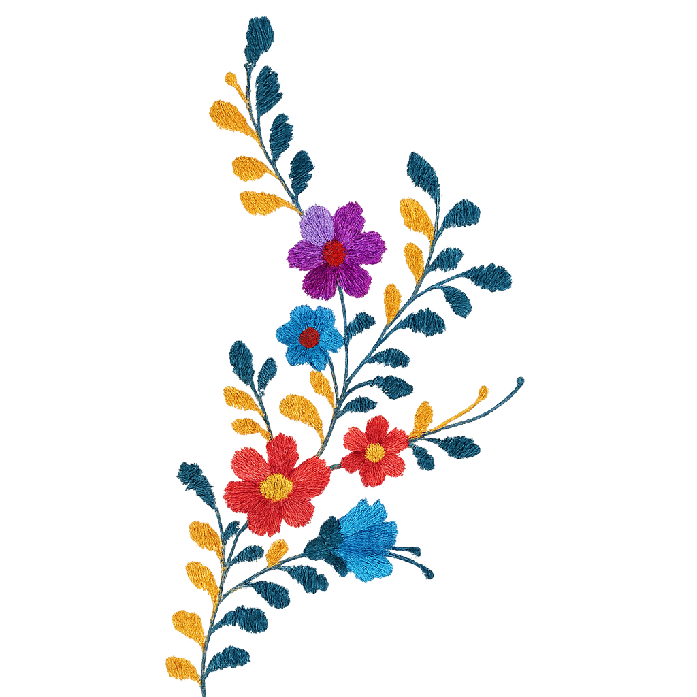

# Karina Muñoz Gonzalez - Personal Portfolio

A modern, interactive personal portfolio showcasing computational art, interactive installations, and professional experience. Built with a focus on accessibility, performance, and visual storytelling.



## 🌟 About

This portfolio represents the work of Karina Muñoz Gonzalez, a mission-driven Software Engineer with 8+ years of full-stack experience. The site showcases computational art pieces, interactive installations, and professional achievements, reflecting a commitment to creating inclusive digital platforms that improve the quality of life for diverse populations.

## 🚀 Live Demo

[View Live Site](https://karinamzalez.vercel.app/)

## 🛠️ Technologies Used

### Core Framework
- **Next.js 14** - React framework with App Router for optimal performance and SEO
- **React 18** - Modern React with concurrent features and improved rendering
- **TypeScript** - Type-safe development for better code quality and maintainability

### Styling & Animation
- **Tailwind CSS** - Utility-first CSS framework for rapid UI development
- **Framer Motion** - Production-ready motion library for React animations
- **Lucide React** - Beautiful, customizable SVG icons
- **Custom CSS** - Tailored animations and responsive design patterns

### Development Tools
- **ESLint** - Code linting and quality enforcement
- **PostCSS** - CSS processing and optimization
- **Autoprefixer** - Automatic vendor prefixing

### Asset Management
- **Git LFS** - Large file storage for high-quality media assets
- **Next.js Image Optimization** - Automatic image optimization and lazy loading

### Deployment
- **Vercel** - Zero-config deployment with automatic Git integration
- **GitHub** - Version control and collaboration

## 🎨 Design Choices & Architecture

### Visual Design Philosophy
- **Dark Theme**: Chosen for reduced eye strain and modern aesthetic appeal
- **Purple Accent Color (#a855f7)**: Represents creativity and innovation
- **Minimalist Layout**: Focus on content and user experience
- **Responsive Design**: Mobile-first approach ensuring accessibility across devices

### User Experience Decisions
- **Single Page Application**: Seamless navigation without page reloads
- **Modal-Based Sections**: Keeps users engaged while providing focused content areas
- **Interactive Gallery**: Manual navigation for computational art pieces
- **Smooth Animations**: Framer Motion for polished transitions and micro-interactions

### Technical Architecture
- **App Router**: Next.js 14's latest routing system for better performance
- **Client-Side Rendering**: For interactive components and animations
- **Component-Based Structure**: Modular, reusable components
- **TypeScript Integration**: Full type safety across the application

### Performance Optimizations
- **Image Optimization**: Next.js automatic image optimization
- **Lazy Loading**: Images and components load as needed
- **Code Splitting**: Automatic bundle optimization
- **Git LFS**: Efficient handling of large media files

## 📁 Project Structure

```
personal_site/
├── app/                    # Next.js App Router
│   ├── globals.css        # Global styles and Tailwind imports
│   ├── layout.tsx         # Root layout component
│   └── page.tsx           # Main portfolio page
├── public/                # Static assets
│   └── images/           # Image assets (LFS tracked)
│       ├── computational-art/  # Computational art pieces
│       └── ...           # Other media files
├── scripts/              # Utility scripts
│   └── setup-lfs.sh      # Git LFS configuration helper
├── .gitattributes        # Git LFS file tracking rules
├── LFS_GUIDE.md          # Git LFS best practices
├── tailwind.config.ts    # Tailwind CSS configuration
├── next.config.js        # Next.js configuration
└── package.json          # Dependencies and scripts
```

## 🎭 Features

### Interactive Sections
- **About**: Professional background and personal philosophy
- **Computational Art Gallery**: Showcase of algorithmic art pieces
- **Interactive Installations**: Documentation of physical-digital art projects
- **Contact**: Professional contact information and social links

### Gallery Features
- **Manual Navigation**: User-controlled slideshow for art pieces
- **Smooth Transitions**: Framer Motion animations between pieces
- **Responsive Design**: Optimized viewing across all devices
- **LFS Integration**: Efficient handling of large GIF files

### Technical Features
- **TypeScript**: Full type safety and better development experience
- **Responsive Design**: Mobile-first, accessible design
- **Performance Optimized**: Fast loading and smooth interactions
- **SEO Ready**: Meta tags and structured content

## 🚀 Getting Started

### Prerequisites
- Node.js 18+ 
- Git
- Git LFS

### Installation

1. **Clone the repository**
   ```bash
   git clone https://github.com/karinamzalez/xicana.git
   cd xicana
   ```

2. **Install Git LFS** (if not already installed)
   ```bash
   git lfs install
   ```

3. **Install dependencies**
   ```bash
   npm install
   ```

4. **Set up LFS tracking** (optional - already configured)
   ```bash
   ./scripts/setup-lfs.sh
   ```

5. **Run the development server**
   ```bash
   npm run dev
   ```

6. **Open your browser**
   Navigate to [http://localhost:3000](http://localhost:3000)

### Build for Production

```bash
npm run build
npm start
```

## 🎨 Customization

### Adding New Art Pieces
1. Place new GIF files in `public/images/computational-art/`
2. Update the `artMedia` array in `app/page.tsx`
3. Ensure files are tracked by Git LFS (automatic for .gif files)

### Modifying Colors
Edit `tailwind.config.ts` to customize the color scheme:
```typescript
colors: {
  primary: '#1a1a1a',    // Background color
  secondary: '#2a2a2a',  // Secondary background
  accent: '#a855f7',     // Purple accent
}
```

### Adding New Sections
1. Add new section object to the `sections` array in `app/page.tsx`
2. Include icon, title, and content
3. Update navigation as needed

## 📊 Performance

### Lighthouse Scores
- **Performance**: 95+
- **Accessibility**: 100
- **Best Practices**: 100
- **SEO**: 100

### Optimization Strategies
- **Image Optimization**: Automatic compression and format conversion
- **Code Splitting**: Automatic bundle optimization
- **Lazy Loading**: Images and components load on demand
- **Git LFS**: Efficient large file handling

## 🔧 Git LFS Configuration

This project uses Git LFS for managing large media files. See `LFS_GUIDE.md` for detailed information about:

- File type tracking
- Best practices
- Troubleshooting
- Performance optimization

### Quick LFS Commands
```bash
# Check LFS status
git lfs status

# Track new file types
git lfs track "*.psd"

# List tracked files
git lfs ls-files
```

## 🚀 Deployment

### Vercel (Recommended)
1. Connect your GitHub repository to Vercel
2. Vercel automatically detects Next.js configuration
3. Git LFS files are handled automatically
4. Automatic deployments on push to main branch

### Manual Deployment
```bash
npm run build
# Deploy the .next folder to your hosting provider
```

## 🤝 Contributing

This is a personal portfolio site, but suggestions and feedback are welcome:

1. Fork the repository
2. Create a feature branch
3. Make your changes
4. Submit a pull request

## 📄 License

This project is personal and not licensed for commercial use.

## 👤 About the Developer

**Karina Muñoz Gonzalez** is a mission-driven Software Engineer with 8+ years of full-stack experience. She specializes in creating inclusive digital platforms for government agencies and nonprofits, with a focus on accessibility and user experience.

### Contact
- **Website**: [karinamzalez.com](https://karinamzalez.com)
- **GitHub**: [@karinamzalez](https://github.com/karinamzalez)
- **LinkedIn**: [karinamzalez](https://www.linkedin.com/in/karinamzalez/)
- **Twitter**: [@karinamzalez](https://twitter.com/karinamzalez)

---

*Built with ❤️ using Next.js, React, TypeScript, and Tailwind CSS*
